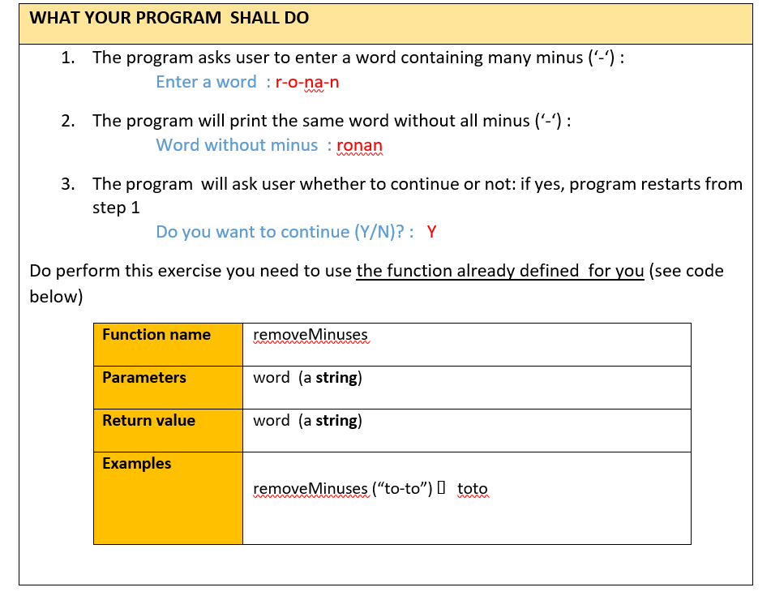
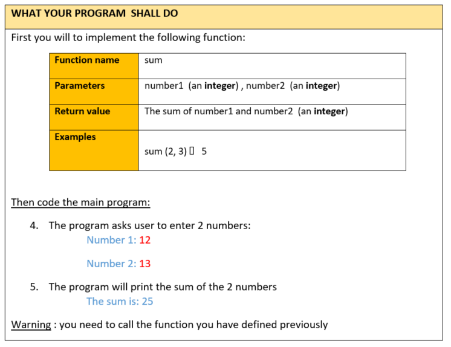
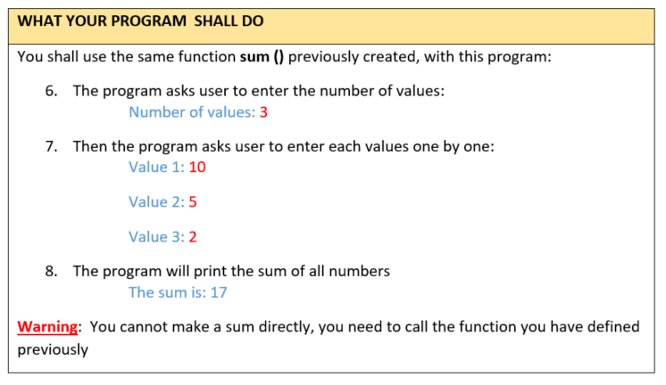
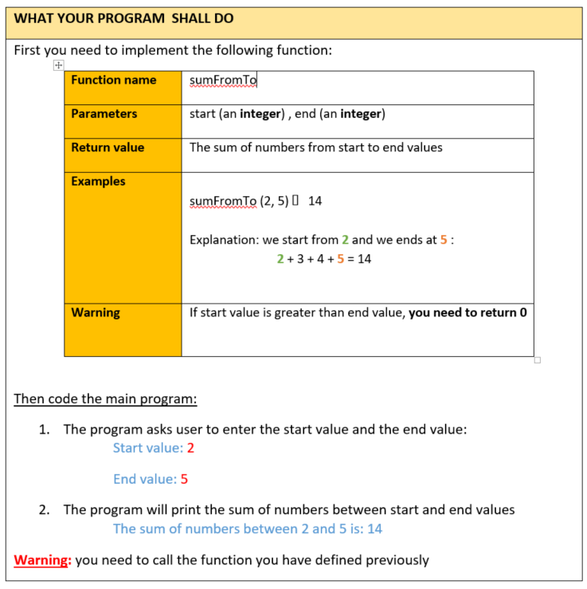

## Exercise correction note

### Exercise #1


#### Step 1: Remove the "-" sign from string
```python
text = "H-e-l-l-o" 
result = ""
for i in range(len(text)):
    if text[i] != '-':
        result += text[i]
print(result) # result: Hello
```

#### Step 2: Convert that code to functions
```python
def removeMinuses(word):
    result = ""
    for i in range(len(word)):
        if word[i]!= '-':
            result += word[i]
    return result
print(removeMinuses("H-e-l-l-o")) # result: Hello
```
#### Step 3: Enter many time until you enter "N" to stop and "Y" to continue
```python
isContinue = True
while isContinue:
    stop = input("Do you want to continue (y/n): ")
    if stop.upper() != "Y":
        isContinue = False
```
#### Step 4: Combine all of them together (`Final code`)
```python
def removeMinuses(word):
    result = ""
    for i in range(len(word)):
        if word[i]!= '-':
            result += word[i]
    return result

isContinue = True
while isContinue:
    text = input("Enter word: ")
    print("Word without minus: " + removeMinuses(text))
    stop = input("Do you want to continue (y/n): ")
    if stop.upper() != "Y":
        isContinue = False
```
### Exercise #2


#### Step 1: Sum 2 numbers
```python
sum = 0
number1 = 10
number2 = 20
sum = number1 + number2
print(sum) # result: 30
```
#### Step 2: Create sum function to use many times 
```python
def sum(number1, number2):
    total = number1 + number2
    return total
```
`OR`
```python
def sum(number1, number2):
    return number1 + number2
```

#### Step 3: Work with input
```python

n1 = int(input("Enter number 1: "))
n2 = int(input("Enter number 2: "))
result = n1 + n2
print(result)
```

#### Step 4: Combine all code together (`Final code`)
```python
def sum(number1, number2):
    return number1 + number2

n1 = int(input("Enter number 1: "))
n2 = int(input("Enter number 2: "))
result = sum(n1, n2)
print(result)
```
### Exercise #3


#### Prviously sum function
```python
def sum(number1, number2):
    return number1 + number2
```

#### Step 1: Number of input times
```python
numberOfValues = int(input("Number of value: "))
for i in range(numberOfValues):
    number = int(input("Value " +str(i + 1) + ": "))
```

#### Step 2: Sum with variable
```python
totalValue = 0
numberOfValues = int(input("Number of value: "))
for i in range(numberOfValues):
    number = int(input("Value " +str(i + 1) + ": "))
    totalValue += number
print(totalValue)
```

#### Step 3: Sum with function previously
```python
def sum(number1, number2):
    return number1 + number2

total  = 0
numberOfValues = int(input("Number of value: "))
for i in range(numberOfValues):
    number = int(input("Value " +str(i + 1) + ": "))
    # store previous value
    if i == 0:
        previousValue = number
    else:
        previousValue = sum(previousValue, number)
    total = previousValue
print(total)
```
`OR`
```python
def sum(number1, number2):
    return number1 + number2

total  = 0
numberOfValues = int(input("Number of value: "))
for i in range(numberOfValues):
    number = int(input("Value " +str(i + 1) + ": "))
    total = sum(total, number)
print(total)
```

### Exercise #4


#### Prviously sum function
```python
def sum(number1, number2):
    return number1 + number2
```

#### Step 1: List down number from start to end
```python
start = int(input("Input start:"))
end = int(input("Input end:"))
for i in range(start, end + 1):
    print(i)
```
`OR`
```python
start = int(input("Input start:"))
end = int(input("Input end:"))
while start <= end:
    print(start)
    start += 1
```
#### Step 2: Combine all code together (`Final code`)
```python
start = int(input("Input start:"))
end = int(input("Input end:"))
total = 0
while start <= end:
    total = sum(total, start)
    start += 1
print("The sum of numbers between " + str(start) + " and " + str(end) + " is: " + str(total))
```